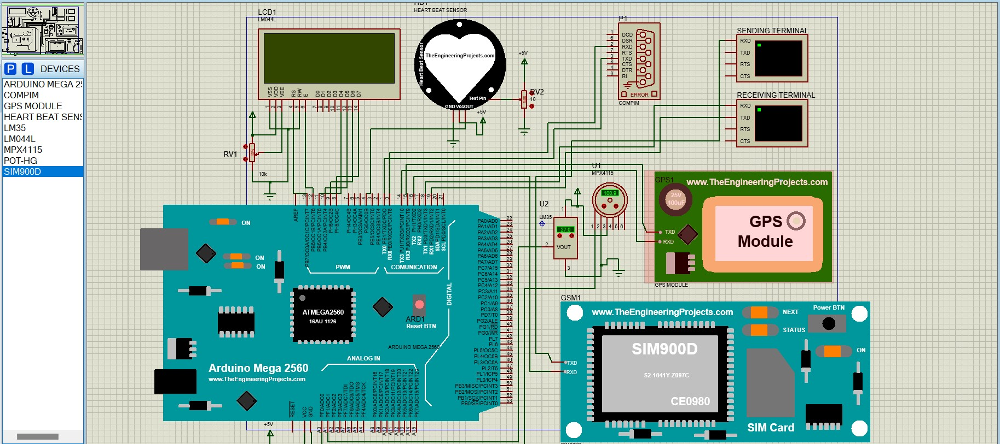

# MEDICAL-CHECKUP-DEVICE
Herein I have built a simulator of a arduino based medical checkup device.

## What It Can Do?
It checks one's pulse rate, blood pressure as well as body temperature. The patient's vitals are visible on the LCD screen attached with it and also on the blynk app. It can send an SOS to the nearest hospital in case the vitals of the patient are not normal i.e. within a specified range. It uses arduino based USB serial to connect to the blynk app as well as the blynk dashboard.

## Arduino Components Used
None as it is software based simulation and the libraries of these components can be downloaded from the web or found in the proteus device library.
```
Arduino Mega 2560, COMPIM, SIM900D, GPS Module, HEART BEAT SENSOR, LM35, LM044L, POT-HG, MPX4115
```
## Screenshots

